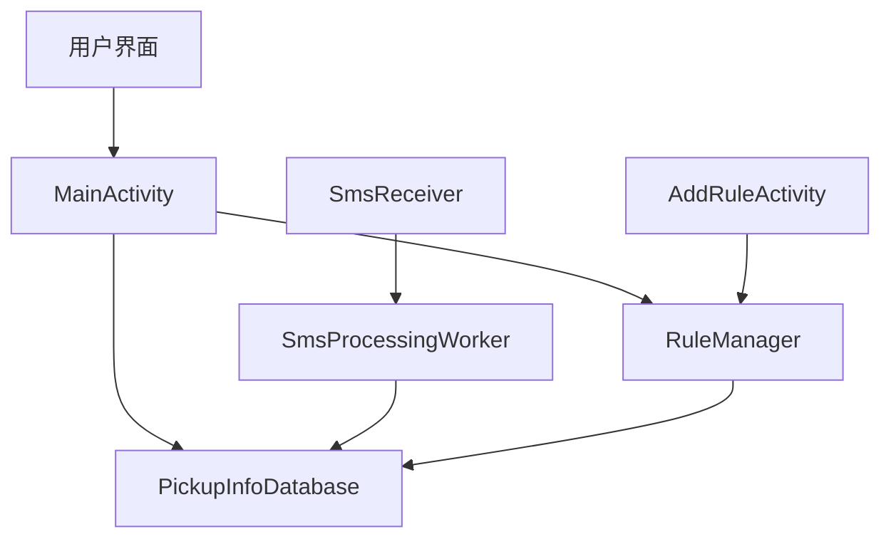
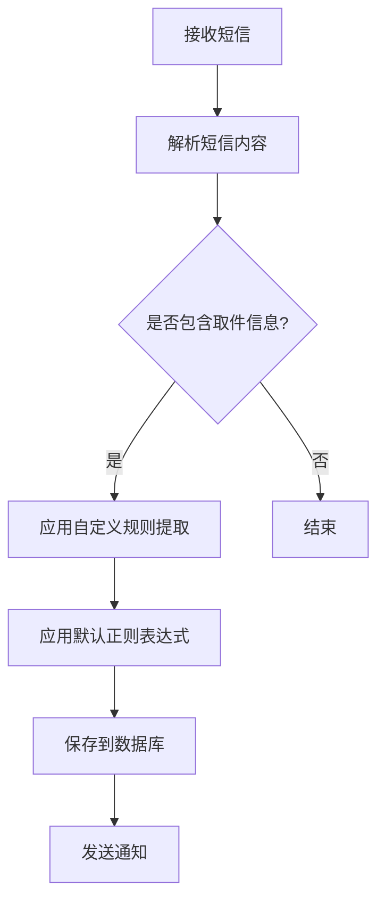
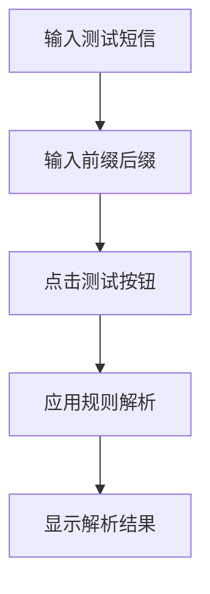
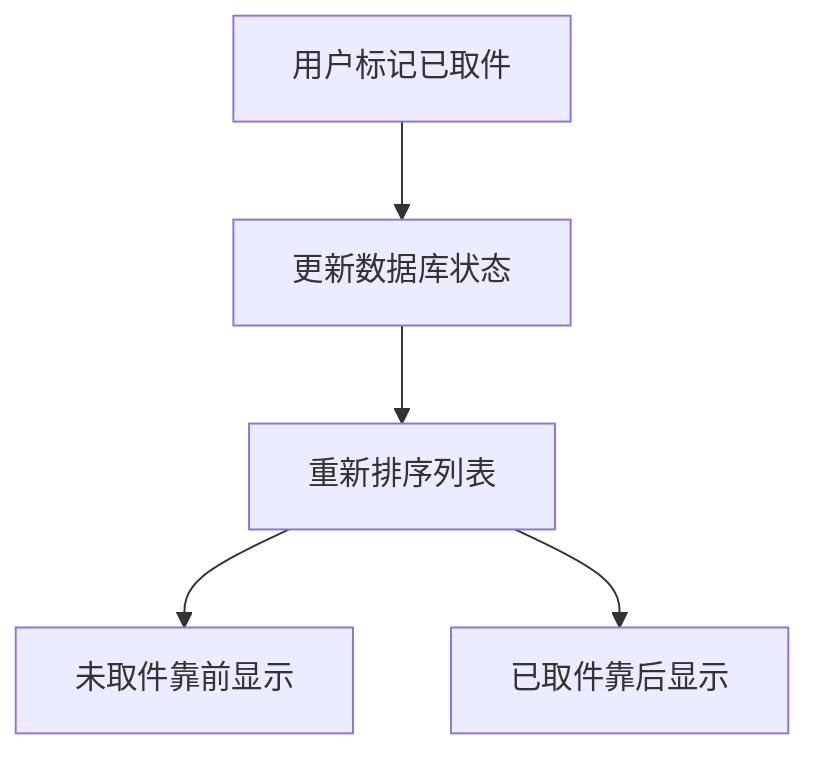

# 取件码助手安卓应用设计文档

## 1. 概述

### 1.1 项目背景
取件码助手是一个基于Android平台的快递取件码管理应用，旨在帮助用户高效管理快递取件码。通过自动读取短信并使用正则规则或自定义规则提取快递信息，用户可以方便地查看和管理取件码。

### 1.2 目标用户
- 需要频繁处理快递取件码的用户
- 网购用户
- 快递代收点工作人员

### 1.3 核心功能
- 自动读取短信并使用正则规则提取或者自定义规则提取快递取件信息
- 展示取件码、快递公司、地址、驿站等信息
- 提供正则规则设置页和自定义规则设置页
- 自定义规则设置使用前后缀模式匹配取件码、快递公司、地址、驿站
- 提供测试短信输入框和匹配结果框，当输入测试短信前后缀后实时解析并展示结果
- 支持下拉刷新获取最新短信，并增加时间限制
- 按状态排序取件信息（未取件靠前，已取件靠后）
- 短信权限的作用说明，被拒绝时弹出友好提示

## 2. 技术架构

### 2.1 架构图

### 2.2 技术选型
- **开发语言**: Java
- **SDK版本**: Android SDK 35
- **UI框架**: Material Design组件
- **数据库**: Room持久化库
- **后台任务**: WorkManager
- **权限管理**: Android运行时权限

### 2.3 设计模式
- MVC模式（Activity作为控制器，XML布局作为视图，数据类作为模型）
- DAO模式（数据访问对象）
- 单例模式（RuleManager）

## 3. 功能模块设计

### 3.1 短信处理模块
负责接收短信并解析其中的取件信息：

#### 3.1.1 SmsReceiver（短信接收器）
- 监听系统短信接收广播
- 解析短信内容提取取件信息
- 使用RuleManager处理短信内容，优先应用用户自定义规则
- 默认正则规则作为备选方案，同时解析取件码、驿站、地址
- 将解析结果传递给后台处理Worker

#### 3.1.2 SmsProcessingWorker（短信处理工作器）
- 在后台线程处理短信解析结果
- 将取件信息保存到数据库
- 发送通知提醒用户

### 3.2 规则管理模块
负责管理用户自定义的解析规则：

#### 3.2.1 Rule（规则实体类）
- id: 规则唯一标识
- name: 规则名称
- prefix: 前缀内容
- suffix: 后缀内容
- infoType: 信息类型（取件码、快递公司、地址、驿站）
- enabled: 规则开关状态（启用/禁用）

#### 3.2.2 RuleManager（规则管理器）
- 加载和管理所有规则
- 应用规则提取信息
- 测试规则功能
- 支持规则的增删改查操作
- 支持规则开关功能
- 同时应用正则规则和自定义规则提取信息
- 优先使用自定义规则解析，默认正则规则作为备选方案

##### 默认正则规则
- 取件码：`([A-Z0-9]+[-]?){1,3}[A-Z0-9]*` （支持3-9位数字或数字字母混合模式，以及带符号的取件码，如120402-2551，1-2-1234，Z-1-1234，D-234等）
- 驿站：`(菜鸟驿站|妈妈驿站|快递驿站|代收点)[^\s]*`
- 地址：`(地址[:：]\s*([^\s]+))|(取件地点[:：]\s*([^\s]+))`
- 快递公司：`(顺丰|中通|圆通|申通|韵达|百世|京东|极兔|德邦|EMS)`

### 3.3 数据库模块
使用Room持久化库管理数据：

#### 3.3.1 PickupInfoDatabase（数据库）
- 应用的主数据库类
- 管理PickupInfo和Rule的DAO

#### 3.3.2 PickupInfoDao（取件信息数据访问对象）
- 提供取件信息的增删改查操作
- 支持按状态查询和搜索功能

#### 3.3.3 RuleDao（规则数据访问对象）
- 提供规则的增删改查操作

### 3.4 用户界面模块

#### 3.4.1 MainActivity（主界面）
- 展示取件信息列表
- 提供底部导航菜单（全部、待取件、已取件、设置）
- 提供搜索功能
- 提供添加规则入口

#### 3.4.2 AddRuleActivity（添加规则界面）
- 提供自定义规则设置功能
- 支持前缀后缀模式匹配
- 提供测试短信输入框和匹配结果展示
- 实时解析测试短信并展示结果

### 3.4.3 正则规则设置页
- 提供正则表达式规则设置功能
- 支持针对不同类型信息（取件码、快递公司、地址、驿站）设置正则表达式
- 提供正则表达式测试功能
- 实时验证正则表达式的有效性
- 支持规则的开关、编辑、删除功能

### 3.4.4 自定义规则设置页
- 提供前后缀模式匹配规则设置
- 支持针对不同类型信息设置前缀和后缀
- 提供测试短信输入框和匹配结果展示
- 实时解析测试短信并展示结果
- 支持规则的开关、编辑、删除功能

### 3.4.5 规则管理界面
- 展示所有规则列表（包括正则规则和自定义规则）
- 支持规则的启用/禁用开关操作
- 支持规则的编辑功能
- 支持规则的删除功能
- 支持规则的添加功能

#### 3.4.6 PickupInfoAdapter（取件信息适配器）
- 为RecyclerView提供数据绑定
- 处理列表项的点击事件
- 根据取件状态使用不同颜色区分显示（未取件使用绿色，已取件使用灰色）

## 4. 数据模型设计

### 4.1 PickupInfo（取件信息）
| 字段名 | 类型 | 说明 |
|-------|------|------|
| id | int | 主键，自动生成 |
| code | String | 取件码 |
| company | String | 快递公司 |
| address | String | 地址 |
| station | String | 驿站 |
| timestamp | long | 时间戳 |
| status | int | 状态（未取件/已取件） |

### 4.2 Rule（规则）
| 字段名 | 类型 | 说明 |
|-------|------|------|
| id | int | 主键，自动生成 |
| name | String | 规则名称 |
| prefix | String | 前缀内容 |
| suffix | String | 后缀内容 |
| infoType | String | 信息类型 |
| enabled | boolean | 规则开关状态（true:启用, false:禁用） |

## 5. 权限设计

### 5.1 必需权限
- `READ_SMS`: 读取短信权限
- `RECEIVE_SMS`: 接收短信权限
- `POST_NOTIFICATIONS`: 发送通知权限（Android 13+）

### 5.2 权限处理
- 应用启动时检查并请求必要权限
- 权限被拒绝时弹出友好提示
- 引导用户手动开启权限
- 提供权限说明页面，解释各权限的作用

## 6. UI设计

### 6.1 主界面
- 顶部标题和功能按钮
- 搜索栏
- 取件信息列表（RecyclerView）
  - 未取件项目使用绿色背景或边框
  - 已取件项目使用灰色背景或边框
- 底部导航菜单

### 6.2 添加规则界面
- 规则名称输入
- 前缀内容输入
- 后缀内容输入
- 信息类型选择（Spinner）
- 保存规则按钮
- 测试短信输入区域
- 测试结果展示区域

## 7. 业务流程

### 7.1 短信处理流程

### 7.2 规则测试流程

### 7.3 取件状态更新流程

## 8. 排序规则
- 未取件的取件码始终排序靠前
- 已取件的取件码自动排序到未取件取件码的后方
- 按时间倒序排列，最新的取件信息排在前面
- 支持下拉刷新获取最新短信
- 支持时间限制筛选，可查看指定时间段内的取件信息

## 9. 测试策略

### 9.1 单元测试
- RuleManager规则解析功能测试
- SmsReceiver短信解析功能测试
- 数据库操作测试
- 正则表达式规则测试
- 自定义规则测试

### 9.2 UI测试
- 主界面功能测试
- 添加规则界面功能测试
- 正则规则设置页测试
- 自定义规则设置页测试
- 导航菜单测试
- 权限请求流程测试

## 10. 安全与权限

### 10.1 权限管理
- 运行时权限请求
- 权限拒绝后的友好提示
- 权限说明和引导
- 提供权限设置页面，用户可随时查看和修改权限

### 10.2 数据安全
- 本地数据库存储
- 敏感信息保护
- 数据备份与恢复
- 短信内容处理后及时清理，避免敏感信息泄露